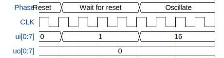

# NCO

**Source:** [https://github.com/pantelis300/tt_um_pantelis300_nco](https://github.com/pantelis300/tt_um_pantelis300_nco)

**TinyTapeout Project Page:** [https://app.tinytapeout.com/projects/3417](https://app.tinytapeout.com/projects/3417)

## Input/Output Definitions

| Signal | Type | Width |
|--------|------|-------|
| ui[0:7] | input | 8 |
| uo[0:7] | output | 8 |

## Test Waveform

