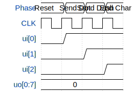

# Morse Code Detector (With Serial RX)

**Source:** [https://github.com/KerCrafter/morse_code_tto](https://github.com/KerCrafter/morse_code_tto)

**TinyTapeout Project Page:** [https://app.tinytapeout.com/projects/3422](https://app.tinytapeout.com/projects/3422)

## Input/Output Definitions

| Signal | Type | Width |
|--------|------|-------|
| ui[0] | input | 1 |
| ui[1] | input | 1 |
| ui[2] | input | 1 |
| uo[0:7] | output | 8 |

## Test Waveform

