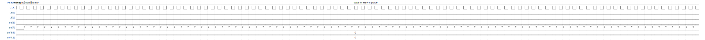

# Wafer.space Logo VGA Screensaver

**Source:** [https://github.com/TinyTapeout/tt-waferspace-vga-screensaver](https://github.com/TinyTapeout/tt-waferspace-vga-screensaver)

**TinyTapeout Project Page:** [https://app.tinytapeout.com/projects/3432](https://app.tinytapeout.com/projects/3432)

## Input/Output Definitions

| Signal | Type | Width |
|--------|------|-------|
| ui[0] | input | 1 |
| ui[1] | input | 1 |
| uo[3] | output | 1 |
| uo[7] | output | 1 |
| uo[4:6] | output | 3 |
| uo[0:2] | output | 3 |

## Test Waveform

