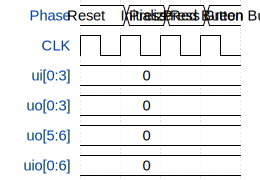

# Simon's Caterpillar

**Source:** [https://github.com/htfab/ttgf0p2-caterpillar](https://github.com/htfab/ttgf0p2-caterpillar)

**TinyTapeout Project Page:** [https://app.tinytapeout.com/projects/3437](https://app.tinytapeout.com/projects/3437)

## Input/Output Definitions

| Signal | Type | Width |
|--------|------|-------|
| ui[0:3] | input | 4 |
| uo[0:3] | output | 4 |
| uo[5:6] | output | 2 |
| uio[0:6] | output | 7 |

## Test Waveform

