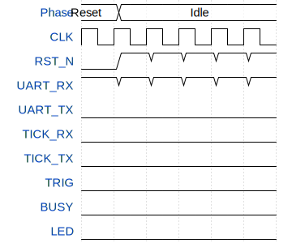

# MarcoPolo

**Source:** [https://github.com/javiBajoCero/ttgf-verilog-template](https://github.com/javiBajoCero/ttgf-verilog-template)

**TinyTapeout Project Page:** [https://app.tinytapeout.com/projects/3454](https://app.tinytapeout.com/projects/3454)

## Input/Output Definitions

| Signal | Type | Width |
|--------|------|-------|
| CLK | clock | 1 |
| RST_N | input | 1 |
| UART_RX | input | 1 |
| UART_TX | output | 1 |
| TICK_RX | output | 1 |
| TICK_TX | output | 1 |
| TRIG | output | 1 |
| BUSY | output | 1 |
| LED | output | 1 |

## Test Waveform

