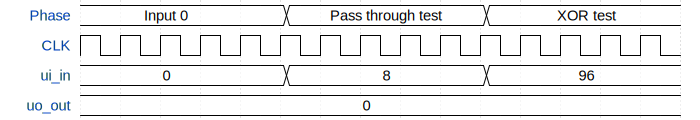

# RandomNum

**Source:** [https://github.com/aakarsh1011/tiny-tapeout](https://github.com/aakarsh1011/tiny-tapeout)

**TinyTapeout Project Page:** [https://app.tinytapeout.com/projects/3503](https://app.tinytapeout.com/projects/3503)

## Input/Output Definitions

| Signal | Type | Width |
|--------|------|-------|
| ui_in | input | 8 |
| uo_out | output | 8 |

## Test Waveform

