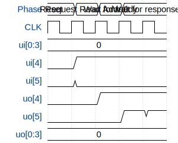

# Tiny D-Cache

**Source:** [https://github.com/Niels5931/ttihp_simple_dcache](https://github.com/Niels5931/ttihp_simple_dcache)

**TinyTapeout Project Page:** [https://app.tinytapeout.com/projects/3522](https://app.tinytapeout.com/projects/3522)

## Input/Output Definitions

| Signal | Type | Width |
|--------|------|-------|
| ui[0:3] | input | 4 |
| ui[4] | input | 1 |
| ui[5] | input | 1 |
| uo[4] | output | 1 |
| uo[5] | output | 1 |
| uo[0:3] | output | 4 |

## Test Waveform

