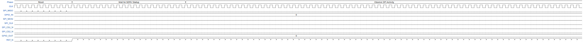

# FH Joanneum TinyTapeout

**Source:** [https://github.com/Electronic-and-Computer-Engineering/TT_IHP26a_FH_uC](https://github.com/Electronic-and-Computer-Engineering/TT_IHP26a_FH_uC)

**TinyTapeout Project Page:** [https://app.tinytapeout.com/projects/3531](https://app.tinytapeout.com/projects/3531)

## Input/Output Definitions

| Signal | Type | Width |
|--------|------|-------|
| SPI_MISO | input | 1 |
| GPIO_IN | input | 4 |
| SPI_MOSI | output | 1 |
| SPI_CLK | output | 1 |
| SPI_CS1_N | output | 1 |
| SPI_CS2_N | output | 1 |
| GPIO_OUT | output | 4 |
| CLK | clock | 1 |
| RST_N | input | 1 |

## Test Waveform

