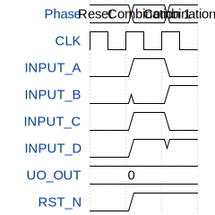

# secretNo

**Source:** [https://github.com/thravax/tt-test](https://github.com/thravax/tt-test)

**TinyTapeout Project Page:** [https://app.tinytapeout.com/projects/3539](https://app.tinytapeout.com/projects/3539)

## Input/Output Definitions

| Signal | Type | Width |
|--------|------|-------|
| INPUT_A | input | 1 |
| INPUT_B | input | 1 |
| INPUT_C | input | 1 |
| INPUT_D | input | 1 |
| UO_OUT | output | 8 |
| CLK | clock | 1 |
| RST_N | input | 1 |

## Test Waveform

