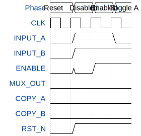

# tiny-tapeout-workshop-result

**Source:** [https://github.com/raninninn/tiny-tapeout-working-repo](https://github.com/raninninn/tiny-tapeout-working-repo)

**TinyTapeout Project Page:** [https://app.tinytapeout.com/projects/3547](https://app.tinytapeout.com/projects/3547)

## Input/Output Definitions

| Signal | Type | Width |
|--------|------|-------|
| INPUT_A | input | 1 |
| INPUT_B | input | 1 |
| ENABLE | input | 1 |
| MUX_OUT | output | 1 |
| COPY_A | output | 1 |
| COPY_B | output | 1 |
| CLK | clock | 1 |
| RST_N | input | 1 |

## Test Waveform

