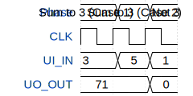

# Mein Hund Gniesbert (Adder for 3)

**Source:** [https://github.com/sisarikaya/mytiny](https://github.com/sisarikaya/mytiny)

**TinyTapeout Project Page:** [https://app.tinytapeout.com/projects/3551](https://app.tinytapeout.com/projects/3551)

## Input/Output Definitions

| Signal | Type | Width |
|--------|------|-------|
| UI_IN | input | 8 |
| UO_OUT | output | 8 |

## Test Waveform

