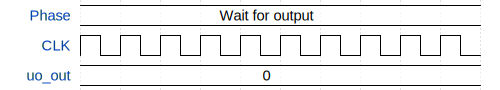

# Primitive clock divider

**Source:** [https://github.com/alexey-serdyuk/tiny_tapeout_workshop](https://github.com/alexey-serdyuk/tiny_tapeout_workshop)

**TinyTapeout Project Page:** [https://app.tinytapeout.com/projects/3552](https://app.tinytapeout.com/projects/3552)

## Input/Output Definitions

| Signal | Type | Width |
|--------|------|-------|
| uo_out | output | 8 |

## Test Waveform

