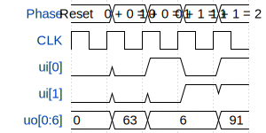

# 7-Segment Adder (0, 1, 2)

**Source:** [https://github.com/Ancash/tt](https://github.com/Ancash/tt)

**TinyTapeout Project Page:** [https://app.tinytapeout.com/projects/3562](https://app.tinytapeout.com/projects/3562)

## Input/Output Definitions

| Signal | Type | Width |
|--------|------|-------|
| ui[0] | input | 1 |
| ui[1] | input | 1 |
| uo[0:6] | output | 7 |

## Test Waveform

