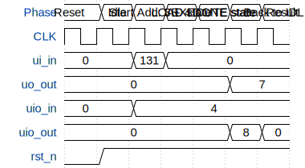

# RTX 8090

**Source:** [https://github.com/agentzz1/GDS_tinytapeout](https://github.com/agentzz1/GDS_tinytapeout)

**TinyTapeout Project Page:** [https://app.tinytapeout.com/projects/3569](https://app.tinytapeout.com/projects/3569)

## Input/Output Definitions

| Signal | Type | Width |
|--------|------|-------|
| ui_in | input | 8 |
| uo_out | output | 8 |
| uio_in | input | 8 |
| uio_out | output | 8 |
| rst_n | input | 1 |

## Test Waveform

