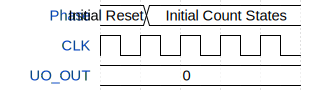

# 18-bit Ripple Counter

**Source:** [https://github.com/by-Tobd/tinytapeout](https://github.com/by-Tobd/tinytapeout)

**TinyTapeout Project Page:** [https://app.tinytapeout.com/projects/3577](https://app.tinytapeout.com/projects/3577)

## Input/Output Definitions

| Signal | Type | Width |
|--------|------|-------|
| CLK | clock | 1 |
| UO_OUT | output | 8 |

## Test Waveform

