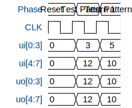

# Invertors Class Template

**Source:** [https://github.com/Shanmukha-ms/cim_tiny_tapeout](https://github.com/Shanmukha-ms/cim_tiny_tapeout)

**TinyTapeout Project Page:** [https://app.tinytapeout.com/projects/3582](https://app.tinytapeout.com/projects/3582)

## Input/Output Definitions

| Signal | Type | Width |
|--------|------|-------|
| ui[0:3] | input | 4 |
| ui[4:7] | input | 4 |
| uo[0:3] | output | 4 |
| uo[4:7] | output | 4 |

## Test Waveform

