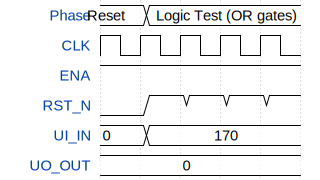

# Tiny Tapeout

**Source:** [https://github.com/AriVishnu-01/Tiny-Tapeout](https://github.com/AriVishnu-01/Tiny-Tapeout)

**TinyTapeout Project Page:** [https://app.tinytapeout.com/projects/3585](https://app.tinytapeout.com/projects/3585)

## Input/Output Definitions

| Signal | Type | Width |
|--------|------|-------|
| ENA | input | 1 |
| RST_N | input | 1 |
| UI_IN | input | 8 |
| UO_OUT | output | 8 |

## Test Waveform

