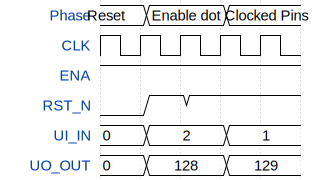

# Test

**Source:** [https://github.com/LordTaek/GDS_Creator](https://github.com/LordTaek/GDS_Creator)

**TinyTapeout Project Page:** [https://app.tinytapeout.com/projects/3610](https://app.tinytapeout.com/projects/3610)

## Input/Output Definitions

| Signal | Type | Width |
|--------|------|-------|
| ENA | input | 1 |
| RST_N | input | 1 |
| UI_IN | input | 8 |
| UO_OUT | output | 8 |

## Test Waveform

