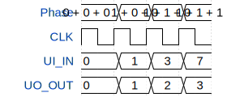

# 1-bit Full Adder

**Source:** [https://github.com/nusli7/TT-Project](https://github.com/nusli7/TT-Project)

**TinyTapeout Project Page:** [https://app.tinytapeout.com/projects/3614](https://app.tinytapeout.com/projects/3614)

## Input/Output Definitions

| Signal | Type | Width |
|--------|------|-------|
| UI_IN | input | 8 |
| UO_OUT | output | 8 |

## Test Waveform

