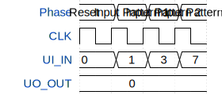

# gatekeeping the gates

**Source:** [https://github.com/Geronymos/tinytapeout](https://github.com/Geronymos/tinytapeout)

**TinyTapeout Project Page:** [https://app.tinytapeout.com/projects/3615](https://app.tinytapeout.com/projects/3615)

## Input/Output Definitions

| Signal | Type | Width |
|--------|------|-------|
| CLK | clock | 1 |
| UI_IN | input | 8 |
| UO_OUT | output | 8 |

## Test Waveform

