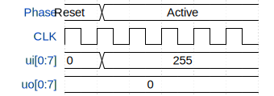

# WIP 7-seg Spinner

**Source:** [https://github.com/DebuggingDisaster/wowki](https://github.com/DebuggingDisaster/wowki)

**TinyTapeout Project Page:** [https://app.tinytapeout.com/projects/3622](https://app.tinytapeout.com/projects/3622)

## Input/Output Definitions

| Signal | Type | Width |
|--------|------|-------|
| CLK | clock | 1 |
| ui[0:7] | input | 8 |
| uo[0:7] | output | 8 |

## Test Waveform

