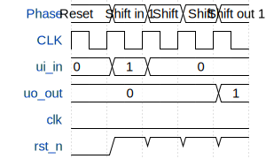

# Test - shift register

**Source:** [https://github.com/sam-m7/tinyTapeoutChip1](https://github.com/sam-m7/tinyTapeoutChip1)

**TinyTapeout Project Page:** [https://app.tinytapeout.com/projects/3626](https://app.tinytapeout.com/projects/3626)

## Input/Output Definitions

| Signal | Type | Width |
|--------|------|-------|
| ui_in | input | 8 |
| uo_out | output | 8 |
| clk | clock | 1 |
| rst_n | input | 1 |

## Test Waveform

