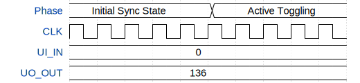

# VGA demo

**Source:** [https://github.com/mattvenn/ihp26a-vga-test](https://github.com/mattvenn/ihp26a-vga-test)

**TinyTapeout Project Page:** [https://app.tinytapeout.com/projects/3630](https://app.tinytapeout.com/projects/3630)

## Input/Output Definitions

| Signal | Type | Width |
|--------|------|-------|
| CLK | clock | 1 |
| UI_IN | input | 8 |
| UO_OUT | output | 8 |

## Test Waveform

