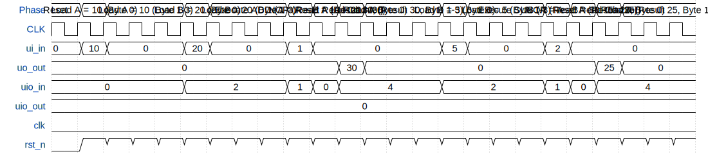

# M31 Mersenne-31 Arithmetic Accelerator

**Source:** [https://github.com/brmurrell3/tt_um_brmurrell3_m31_accel](https://github.com/brmurrell3/tt_um_brmurrell3_m31_accel)

**TinyTapeout Project Page:** [https://app.tinytapeout.com/projects/3641](https://app.tinytapeout.com/projects/3641)

## Input/Output Definitions

| Signal | Type | Width |
|--------|------|-------|
| ui_in | input | 8 |
| uo_out | output | 8 |
| uio_in | input | 8 |
| uio_out | output | 8 |
| clk | clock | 1 |
| rst_n | input | 1 |

## Test Waveform

