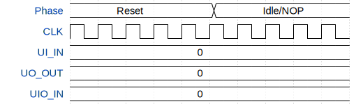

# TeenySPU

**Source:** [https://github.com/umn-geocommons/tt_um_teenyspu](https://github.com/umn-geocommons/tt_um_teenyspu)

**TinyTapeout Project Page:** [https://app.tinytapeout.com/projects/3665](https://app.tinytapeout.com/projects/3665)

## Input/Output Definitions

| Signal | Type | Width |
|--------|------|-------|
| UI_IN | input | 8 |
| UO_OUT | output | 8 |
| UIO_IN | input | 8 |

## Test Waveform

