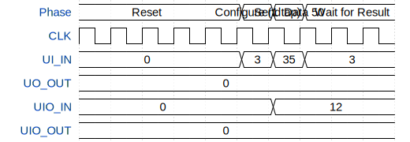

# Moving Average Filter

**Source:** [https://github.com/jonathan-farah/Sensors_and_Security](https://github.com/jonathan-farah/Sensors_and_Security)

**TinyTapeout Project Page:** [https://app.tinytapeout.com/projects/3666](https://app.tinytapeout.com/projects/3666)

## Input/Output Definitions

| Signal | Type | Width |
|--------|------|-------|
| UI_IN | input | 8 |
| UO_OUT | output | 8 |
| UIO_IN | input | 6 |
| UIO_OUT | output | 2 |

## Test Waveform

