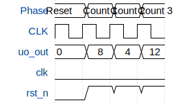

# Counter Circuit

**Source:** [https://github.com/Mr-Seoul/TinyTapeOutGDS](https://github.com/Mr-Seoul/TinyTapeOutGDS)

**TinyTapeout Project Page:** [https://app.tinytapeout.com/projects/3676](https://app.tinytapeout.com/projects/3676)

## Input/Output Definitions

| Signal | Type | Width |
|--------|------|-------|
| uo_out | output | 8 |
| clk | clock | 1 |
| rst_n | input | 1 |

## Test Waveform

