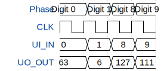

# 7 Segment BCD / CLA

**Source:** [https://github.com/gcgc321/Tiny-Tapeout-Carry-Look-Ahead-Adder](https://github.com/gcgc321/Tiny-Tapeout-Carry-Look-Ahead-Adder)

**TinyTapeout Project Page:** [https://app.tinytapeout.com/projects/3684](https://app.tinytapeout.com/projects/3684)

## Input/Output Definitions

| Signal | Type | Width |
|--------|------|-------|
| UI_IN | input | 8 |
| UO_OUT | output | 8 |

## Test Waveform

