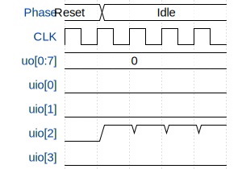

# SPI RAM Driver

**Source:** [https://github.com/Romultra/2-bit-adder-TTIHP26a](https://github.com/Romultra/2-bit-adder-TTIHP26a)

**TinyTapeout Project Page:** [https://app.tinytapeout.com/projects/3692](https://app.tinytapeout.com/projects/3692)

## Input/Output Definitions

| Signal | Type | Width |
|--------|------|-------|
| CLK | clock | 1 |
| uo[0:7] | output | 8 |
| uio[0] | output | 1 |
| uio[1] | output | 1 |
| uio[2] | input | 1 |
| uio[3] | output | 1 |

## Test Waveform

