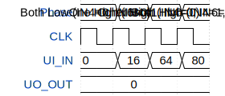

# Scott's first Wokwi design

**Source:** [https://github.com/giffel1/Scott-s-first-Wokwi-design](https://github.com/giffel1/Scott-s-first-Wokwi-design)

**TinyTapeout Project Page:** [https://app.tinytapeout.com/projects/3706](https://app.tinytapeout.com/projects/3706)

## Input/Output Definitions

| Signal | Type | Width |
|--------|------|-------|
| UI_IN | input | 8 |
| UO_OUT | output | 8 |

## Test Waveform

