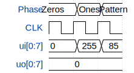

# Amaury Basic Test

**Source:** [https://github.com/Ora-ng3/tiny-tapeout-basic](https://github.com/Ora-ng3/tiny-tapeout-basic)

**TinyTapeout Project Page:** [https://app.tinytapeout.com/projects/3712](https://app.tinytapeout.com/projects/3712)

## Input/Output Definitions

| Signal | Type | Width |
|--------|------|-------|
| ui[0:7] | input | 8 |
| uo[0:7] | output | 8 |

## Test Waveform

