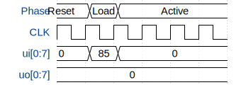

# ISC77x8 Side Scrolling Display

**Source:** [https://github.com/HansAdam2077/ISC77x8](https://github.com/HansAdam2077/ISC77x8)

**TinyTapeout Project Page:** [https://app.tinytapeout.com/projects/3717](https://app.tinytapeout.com/projects/3717)

## Input/Output Definitions

| Signal | Type | Width |
|--------|------|-------|
| CLK | clock | 1 |
| ui[0:7] | input | 8 |
| uo[0:7] | output | 8 |

## Test Waveform

