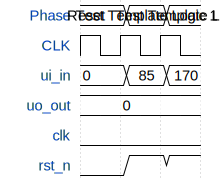

# Hidden combination

**Source:** [https://github.com/johannakin1/Hemmeligkode](https://github.com/johannakin1/Hemmeligkode)

**TinyTapeout Project Page:** [https://app.tinytapeout.com/projects/3718](https://app.tinytapeout.com/projects/3718)

## Input/Output Definitions

| Signal | Type | Width |
|--------|------|-------|
| ui_in | input | 8 |
| uo_out | output | 8 |
| clk | clock | 1 |
| rst_n | input | 1 |

## Test Waveform

