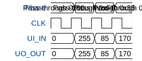

# tt3723-7seg-viewer

**Source:** [https://github.com/Ghunk09/ttworkshop_TEST](https://github.com/Ghunk09/ttworkshop_TEST)

**TinyTapeout Project Page:** [https://app.tinytapeout.com/projects/3723](https://app.tinytapeout.com/projects/3723)

## Input/Output Definitions

| Signal | Type | Width |
|--------|------|-------|
| UI_IN | input | 8 |
| UO_OUT | output | 8 |

## Test Waveform

