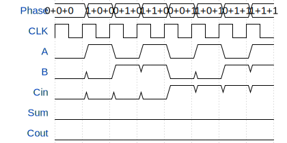

# fullAdder

**Source:** [https://github.com/Nazgul-0/tinytapeoutGDS](https://github.com/Nazgul-0/tinytapeoutGDS)

**TinyTapeout Project Page:** [https://app.tinytapeout.com/projects/3731](https://app.tinytapeout.com/projects/3731)

## Input/Output Definitions

| Signal | Type | Width |
|--------|------|-------|
| A | input | 1 |
| B | input | 1 |
| Cin | input | 1 |
| Sum | output | 1 |
| Cout | output | 1 |

## Test Waveform

