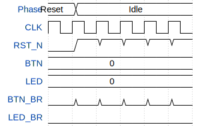

# Tschai's Tic-Tac-Toe

**Source:** [https://github.com/tschai-yim/ttihp-mill](https://github.com/tschai-yim/ttihp-mill)

**TinyTapeout Project Page:** [https://app.tinytapeout.com/projects/3979](https://app.tinytapeout.com/projects/3979)

## Input/Output Definitions

| Signal | Type | Width |
|--------|------|-------|
| CLK | clock | 1 |
| RST_N | input | 1 |
| BTN | input | 8 |
| LED | output | 8 |
| BTN_BR | inout | 1 |
| LED_BR | inout | 1 |

## Test Waveform

