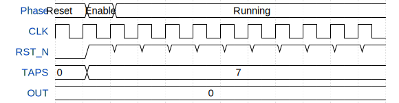

# Verilog Multistage Oscillator with Enable and Counter

**Source:** [https://github.com/RemingtonHolder/tapeout_verilog](https://github.com/RemingtonHolder/tapeout_verilog)

**TinyTapeout Project Page:** [https://app.tinytapeout.com/projects/3404](https://app.tinytapeout.com/projects/3404)

## Input/Output Definitions

| Signal | Type | Width |
|--------|------|-------|
| CLK | clock | 1 |
| RST_N | input | 1 |
| TAPS | input | 3 |
| OUT | output | 8 |

## Test Waveform

