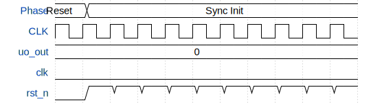

# My (S)VGA Playground

**Source:** [https://github.com/rejunity/tt-vga-sandbox](https://github.com/rejunity/tt-vga-sandbox)

**TinyTapeout Project Page:** [https://app.tinytapeout.com/projects/3405](https://app.tinytapeout.com/projects/3405)

## Input/Output Definitions

| Signal | Type | Width |
|--------|------|-------|
| uo_out | output | 8 |
| clk | clock | 1 |
| rst_n | input | 1 |

## Bit Patterns

### Output (uo_out)
- **uo_out**: Output signal mappings

## Test Waveform

