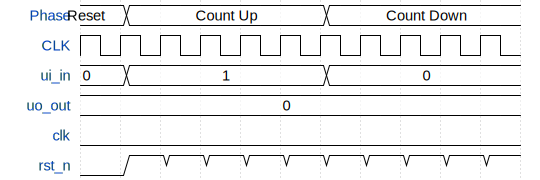

# Counter

**Source:** [https://github.com/oscargus/ttsky-vhdl-makeAchip-izaha684](https://github.com/oscargus/ttsky-vhdl-makeAchip-izaha684)

**TinyTapeout Project Page:** [https://app.tinytapeout.com/projects/3410](https://app.tinytapeout.com/projects/3410)

## Input/Output Definitions

| Signal | Type | Width |
|--------|------|-------|
| ui_in | input | 8 |
| uo_out | output | 8 |
| clk | clock | 1 |
| rst_n | input | 1 |

## First 10 Cycles

| Cycle | Phase | ui_in | uo_out | rst_n |
|-------|-------|-------|-------|-------|
| 0 | Reset | 0x0 (direction [count up || down]=0) | 0x0 (7seg a=0, 7seg b=0, 7seg c=0, 7seg d=0, 7seg e=0, 7seg f=0, 7seg g=0, 7seg h (dot)=0) | 0x0 |
| 1 | Count Up | 0x1 (direction [count up || down]=1) | 0x0 (7seg a=0, 7seg b=0, 7seg c=0, 7seg d=0, 7seg e=0, 7seg f=0, 7seg g=0, 7seg h (dot)=0) | 0x1 |
| 2 | Count Up | 0x1 (direction [count up || down]=1) | 0x0 (7seg a=0, 7seg b=0, 7seg c=0, 7seg d=0, 7seg e=0, 7seg f=0, 7seg g=0, 7seg h (dot)=0) | 0x1 |
| 3 | Count Up | 0x1 (direction [count up || down]=1) | 0x0 (7seg a=0, 7seg b=0, 7seg c=0, 7seg d=0, 7seg e=0, 7seg f=0, 7seg g=0, 7seg h (dot)=0) | 0x1 |
| 4 | Count Up | 0x1 (direction [count up || down]=1) | 0x0 (7seg a=0, 7seg b=0, 7seg c=0, 7seg d=0, 7seg e=0, 7seg f=0, 7seg g=0, 7seg h (dot)=0) | 0x1 |
| 5 | Count Up | 0x1 (direction [count up || down]=1) | 0x0 (7seg a=0, 7seg b=0, 7seg c=0, 7seg d=0, 7seg e=0, 7seg f=0, 7seg g=0, 7seg h (dot)=0) | 0x1 |
| 6 | Count Down | 0x0 (direction [count up || down]=0) | 0x0 (7seg a=0, 7seg b=0, 7seg c=0, 7seg d=0, 7seg e=0, 7seg f=0, 7seg g=0, 7seg h (dot)=0) | 0x1 |
| 7 | Count Down | 0x0 (direction [count up || down]=0) | 0x0 (7seg a=0, 7seg b=0, 7seg c=0, 7seg d=0, 7seg e=0, 7seg f=0, 7seg g=0, 7seg h (dot)=0) | 0x1 |
| 8 | Count Down | 0x0 (direction [count up || down]=0) | 0x0 (7seg a=0, 7seg b=0, 7seg c=0, 7seg d=0, 7seg e=0, 7seg f=0, 7seg g=0, 7seg h (dot)=0) | 0x1 |
| 9 | Count Down | 0x0 (direction [count up || down]=0) | 0x0 (7seg a=0, 7seg b=0, 7seg c=0, 7seg d=0, 7seg e=0, 7seg f=0, 7seg g=0, 7seg h (dot)=0) | 0x1 |

## Bit Patterns

### Input (ui_in)
- **ui_in**: Input signal mappings

### Output (uo_out)
- **uo_out**: Output signal mappings

## Test Waveform

