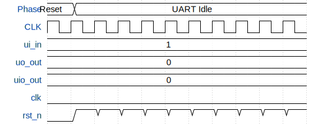

# KianV RISC-V RV32E Baremetal SoC

**Source:** [https://github.com/by17s/RISCV-KianV-BareMetalStyle](https://github.com/by17s/RISCV-KianV-BareMetalStyle)

**TinyTapeout Project Page:** [https://app.tinytapeout.com/projects/3420](https://app.tinytapeout.com/projects/3420)

## Input/Output Definitions

| Signal | Type | Width |
|--------|------|-------|
| ui_in | input | 8 |
| uo_out | output | 8 |
| uio_out | output | 8 |
| clk | clock | 1 |
| rst_n | input | 1 |

## Bit Patterns

### Input (ui_in)
- **ui_in**: Input signal mappings

### Output (uo_out)
- **uo_out**: Output signal mappings

## Test Waveform

