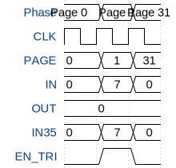

# Cell mux

**Source:** [https://github.com/htfab/ttgf0p2-cells](https://github.com/htfab/ttgf0p2-cells)

**TinyTapeout Project Page:** [https://app.tinytapeout.com/projects/3439](https://app.tinytapeout.com/projects/3439)

## Input/Output Definitions

| Signal | Type | Width |
|--------|------|-------|
| PAGE | input | 5 |
| IN | input | 3 |
| OUT | output | 8 |
| IN35 | inout | 3 |
| EN_TRI | inout | 1 |

## Test Waveform

