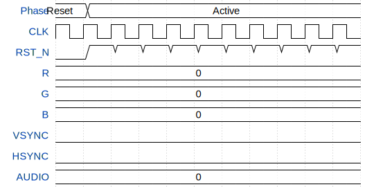

# VGA Drop (audio/visual demo)

**Source:** [https://github.com/rejunity/tt08-vga-drop](https://github.com/rejunity/tt08-vga-drop)

**TinyTapeout Project Page:** [https://app.tinytapeout.com/projects/3449](https://app.tinytapeout.com/projects/3449)

## Input/Output Definitions

| Signal | Type | Width |
|--------|------|-------|
| CLK | clock | 1 |
| RST_N | input | 1 |
| R | output | 2 |
| G | output | 2 |
| B | output | 2 |
| VSYNC | output | 1 |
| HSYNC | output | 1 |
| AUDIO | inout | 8 |

## Test Waveform

