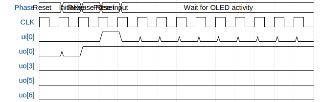

# Frequency Counter SSD1306 OLED

**Source:** [https://github.com/embelon/ttgf-frequency-counter-oled](https://github.com/embelon/ttgf-frequency-counter-oled)

**TinyTapeout Project Page:** [https://app.tinytapeout.com/projects/3462](https://app.tinytapeout.com/projects/3462)

## Input/Output Definitions

| Signal | Type | Width |
|--------|------|-------|
| ui[0] | input | 1 |
| uo[0] | output | 1 |
| uo[3] | output | 1 |
| uo[5] | output | 1 |
| uo[6] | output | 1 |

## Test Waveform

