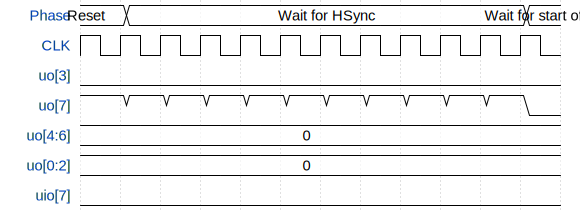

# Flame demo

**Source:** [https://github.com/kbeckmann/ttgf0p2-kbeckmann-flame](https://github.com/kbeckmann/ttgf0p2-kbeckmann-flame)

**TinyTapeout Project Page:** [https://app.tinytapeout.com/projects/3477](https://app.tinytapeout.com/projects/3477)

## Input/Output Definitions

| Signal | Type | Width |
|--------|------|-------|
| uo[3] | output | 1 |
| uo[7] | output | 1 |
| uo[4:6] | output | 3 |
| uo[0:2] | output | 3 |
| uio[7] | output | 1 |

## Test Waveform

