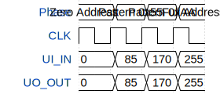

# Chip ROM

**Source:** [https://github.com/TinyTapeout/tt-chip-rom](https://github.com/TinyTapeout/tt-chip-rom)

**TinyTapeout Project Page:** [https://app.tinytapeout.com/projects/3486](https://app.tinytapeout.com/projects/3486)

## Input/Output Definitions

| Signal | Type | Width |
|--------|------|-------|
| UI_IN | input | 8 |
| UO_OUT | output | 8 |

## First 10 Cycles

| Cycle | Phase | UI_IN | UO_OUT |
|-------|-------|-------|-------|
| 0 | Zero Address | 0x0 | 0x0 |
| 1 | Pattern 0x55 | 0x55 | 0x55 |
| 2 | Pattern 0xAA | 0xaa | 0xaa |
| 3 | Full Address | 0xff | 0xff |

## Test Waveform

