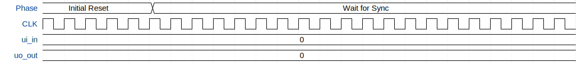

# VGA Tiny Logo Roto Zoomer

**Source:** [https://github.com/rejunity/ttihp26a-vga-tiny-logo-rotozoomer](https://github.com/rejunity/ttihp26a-vga-tiny-logo-rotozoomer)

**TinyTapeout Project Page:** [https://app.tinytapeout.com/projects/3489](https://app.tinytapeout.com/projects/3489)

## Input/Output Definitions

| Signal | Type | Width |
|--------|------|-------|
| ui_in | input | 8 |
| uo_out | output | 8 |

## Test Waveform

