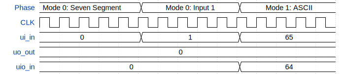

# Universal Binary to Segment Decoder

**Source:** [https://github.com/RebeccaRGB/ttihp-ubcd](https://github.com/RebeccaRGB/ttihp-ubcd)

**TinyTapeout Project Page:** [https://app.tinytapeout.com/projects/3491](https://app.tinytapeout.com/projects/3491)

## Input/Output Definitions

| Signal | Type | Width |
|--------|------|-------|
| ui_in | input | 8 |
| uo_out | output | 8 |
| uio_in | input | 8 |

## First 10 Cycles

| Cycle | Phase | ui_in | uo_out | uio_in |
|-------|-------|-------|-------|-------|
| 0 | Mode 0: Seven Segment | 0x0 (A; D0; A1; A=0, B; D1; B1; B=0, C; D2; C1; C=0, D; D3; D1; D=0, V0; D4; A2; E=0, V1; D5; B2; -=0, V2; D6; C2; /VBI=0, /RBI; LC; D2; /RBI=0) | 0x0 (Segment a; U1; a=0, Segment b; U2; b=0, Segment c; V1; c=0, Segment d; V2; d=0, Segment e; W1; e=0, Segment f; W2; f=0, Segment g; X1; g=0, /RBO; /LTR; X2; /RBO=0) | 0x0 (X6; X6; Y1; h=0, X7; X7; Y2; V=0, X9; X9; /LT1; -=0, /LT; FS; /LT2; /LT=0, /BI (blanking input)=0, /AL (active low)=0, M0 (mode select)=0, M1 (mode select)=0) |
| 1 | Mode 0: Seven Segment | 0x0 (A; D0; A1; A=0, B; D1; B1; B=0, C; D2; C1; C=0, D; D3; D1; D=0, V0; D4; A2; E=0, V1; D5; B2; -=0, V2; D6; C2; /VBI=0, /RBI; LC; D2; /RBI=0) | 0x0 (Segment a; U1; a=0, Segment b; U2; b=0, Segment c; V1; c=0, Segment d; V2; d=0, Segment e; W1; e=0, Segment f; W2; f=0, Segment g; X1; g=0, /RBO; /LTR; X2; /RBO=0) | 0x0 (X6; X6; Y1; h=0, X7; X7; Y2; V=0, X9; X9; /LT1; -=0, /LT; FS; /LT2; /LT=0, /BI (blanking input)=0, /AL (active low)=0, M0 (mode select)=0, M1 (mode select)=0) |
| 2 | Mode 0: Seven Segment | 0x0 (A; D0; A1; A=0, B; D1; B1; B=0, C; D2; C1; C=0, D; D3; D1; D=0, V0; D4; A2; E=0, V1; D5; B2; -=0, V2; D6; C2; /VBI=0, /RBI; LC; D2; /RBI=0) | 0x0 (Segment a; U1; a=0, Segment b; U2; b=0, Segment c; V1; c=0, Segment d; V2; d=0, Segment e; W1; e=0, Segment f; W2; f=0, Segment g; X1; g=0, /RBO; /LTR; X2; /RBO=0) | 0x0 (X6; X6; Y1; h=0, X7; X7; Y2; V=0, X9; X9; /LT1; -=0, /LT; FS; /LT2; /LT=0, /BI (blanking input)=0, /AL (active low)=0, M0 (mode select)=0, M1 (mode select)=0) |
| 3 | Mode 0: Seven Segment | 0x0 (A; D0; A1; A=0, B; D1; B1; B=0, C; D2; C1; C=0, D; D3; D1; D=0, V0; D4; A2; E=0, V1; D5; B2; -=0, V2; D6; C2; /VBI=0, /RBI; LC; D2; /RBI=0) | 0x0 (Segment a; U1; a=0, Segment b; U2; b=0, Segment c; V1; c=0, Segment d; V2; d=0, Segment e; W1; e=0, Segment f; W2; f=0, Segment g; X1; g=0, /RBO; /LTR; X2; /RBO=0) | 0x0 (X6; X6; Y1; h=0, X7; X7; Y2; V=0, X9; X9; /LT1; -=0, /LT; FS; /LT2; /LT=0, /BI (blanking input)=0, /AL (active low)=0, M0 (mode select)=0, M1 (mode select)=0) |
| 4 | Mode 0: Seven Segment | 0x0 (A; D0; A1; A=0, B; D1; B1; B=0, C; D2; C1; C=0, D; D3; D1; D=0, V0; D4; A2; E=0, V1; D5; B2; -=0, V2; D6; C2; /VBI=0, /RBI; LC; D2; /RBI=0) | 0x0 (Segment a; U1; a=0, Segment b; U2; b=0, Segment c; V1; c=0, Segment d; V2; d=0, Segment e; W1; e=0, Segment f; W2; f=0, Segment g; X1; g=0, /RBO; /LTR; X2; /RBO=0) | 0x0 (X6; X6; Y1; h=0, X7; X7; Y2; V=0, X9; X9; /LT1; -=0, /LT; FS; /LT2; /LT=0, /BI (blanking input)=0, /AL (active low)=0, M0 (mode select)=0, M1 (mode select)=0) |
| 5 | Mode 0: Input 1 | 0x1 (A; D0; A1; A=1, B; D1; B1; B=0, C; D2; C1; C=0, D; D3; D1; D=0, V0; D4; A2; E=0, V1; D5; B2; -=0, V2; D6; C2; /VBI=0, /RBI; LC; D2; /RBI=0) | 0x0 (Segment a; U1; a=0, Segment b; U2; b=0, Segment c; V1; c=0, Segment d; V2; d=0, Segment e; W1; e=0, Segment f; W2; f=0, Segment g; X1; g=0, /RBO; /LTR; X2; /RBO=0) | 0x0 (X6; X6; Y1; h=0, X7; X7; Y2; V=0, X9; X9; /LT1; -=0, /LT; FS; /LT2; /LT=0, /BI (blanking input)=0, /AL (active low)=0, M0 (mode select)=0, M1 (mode select)=0) |
| 6 | Mode 0: Input 1 | 0x1 (A; D0; A1; A=1, B; D1; B1; B=0, C; D2; C1; C=0, D; D3; D1; D=0, V0; D4; A2; E=0, V1; D5; B2; -=0, V2; D6; C2; /VBI=0, /RBI; LC; D2; /RBI=0) | 0x0 (Segment a; U1; a=0, Segment b; U2; b=0, Segment c; V1; c=0, Segment d; V2; d=0, Segment e; W1; e=0, Segment f; W2; f=0, Segment g; X1; g=0, /RBO; /LTR; X2; /RBO=0) | 0x0 (X6; X6; Y1; h=0, X7; X7; Y2; V=0, X9; X9; /LT1; -=0, /LT; FS; /LT2; /LT=0, /BI (blanking input)=0, /AL (active low)=0, M0 (mode select)=0, M1 (mode select)=0) |
| 7 | Mode 0: Input 1 | 0x1 (A; D0; A1; A=1, B; D1; B1; B=0, C; D2; C1; C=0, D; D3; D1; D=0, V0; D4; A2; E=0, V1; D5; B2; -=0, V2; D6; C2; /VBI=0, /RBI; LC; D2; /RBI=0) | 0x0 (Segment a; U1; a=0, Segment b; U2; b=0, Segment c; V1; c=0, Segment d; V2; d=0, Segment e; W1; e=0, Segment f; W2; f=0, Segment g; X1; g=0, /RBO; /LTR; X2; /RBO=0) | 0x0 (X6; X6; Y1; h=0, X7; X7; Y2; V=0, X9; X9; /LT1; -=0, /LT; FS; /LT2; /LT=0, /BI (blanking input)=0, /AL (active low)=0, M0 (mode select)=0, M1 (mode select)=0) |
| 8 | Mode 0: Input 1 | 0x1 (A; D0; A1; A=1, B; D1; B1; B=0, C; D2; C1; C=0, D; D3; D1; D=0, V0; D4; A2; E=0, V1; D5; B2; -=0, V2; D6; C2; /VBI=0, /RBI; LC; D2; /RBI=0) | 0x0 (Segment a; U1; a=0, Segment b; U2; b=0, Segment c; V1; c=0, Segment d; V2; d=0, Segment e; W1; e=0, Segment f; W2; f=0, Segment g; X1; g=0, /RBO; /LTR; X2; /RBO=0) | 0x0 (X6; X6; Y1; h=0, X7; X7; Y2; V=0, X9; X9; /LT1; -=0, /LT; FS; /LT2; /LT=0, /BI (blanking input)=0, /AL (active low)=0, M0 (mode select)=0, M1 (mode select)=0) |
| 9 | Mode 0: Input 1 | 0x1 (A; D0; A1; A=1, B; D1; B1; B=0, C; D2; C1; C=0, D; D3; D1; D=0, V0; D4; A2; E=0, V1; D5; B2; -=0, V2; D6; C2; /VBI=0, /RBI; LC; D2; /RBI=0) | 0x0 (Segment a; U1; a=0, Segment b; U2; b=0, Segment c; V1; c=0, Segment d; V2; d=0, Segment e; W1; e=0, Segment f; W2; f=0, Segment g; X1; g=0, /RBO; /LTR; X2; /RBO=0) | 0x0 (X6; X6; Y1; h=0, X7; X7; Y2; V=0, X9; X9; /LT1; -=0, /LT; FS; /LT2; /LT=0, /BI (blanking input)=0, /AL (active low)=0, M0 (mode select)=0, M1 (mode select)=0) |

## Bit Patterns

### Input (ui_in)
- **ui_in**: Input signal mappings

### Output (uo_out)
- **uo_out**: Output signal mappings

### Bidirectional (uio_in)
- **uio_in**: Bidirectional signal mappings

## Test Waveform

