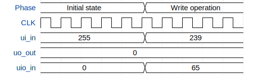

# Hardware UTF Encoder/Decoder

**Source:** [https://github.com/RebeccaRGB/ttihp-hardware-utf8](https://github.com/RebeccaRGB/ttihp-hardware-utf8)

**TinyTapeout Project Page:** [https://app.tinytapeout.com/projects/3492](https://app.tinytapeout.com/projects/3492)

## Input/Output Definitions

| Signal | Type | Width |
|--------|------|-------|
| ui_in | input | 8 |
| uo_out | output | 8 |
| uio_in | input | 8 |

## Test Waveform

