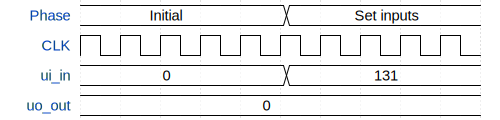

# test

**Source:** [https://github.com/hemanthkrishna5/tiny_tape_out](https://github.com/hemanthkrishna5/tiny_tape_out)

**TinyTapeout Project Page:** [https://app.tinytapeout.com/projects/3504](https://app.tinytapeout.com/projects/3504)

## Input/Output Definitions

| Signal | Type | Width |
|--------|------|-------|
| ui_in | input | 8 |
| uo_out | output | 8 |

## First 10 Cycles

| Cycle | Phase | ui_in | uo_out |
|-------|-------|-------|-------|
| 0 | Initial | 0x0 (input a=0, input b=0, mux sel=0, input d=0) | 0x0 (seg a=0, seg b=0, seg c=0, seg d=0, seg e=0, seg f=0, seg g=0, seg dp=0) |
| 1 | Initial | 0x0 (input a=0, input b=0, mux sel=0, input d=0) | 0x0 (seg a=0, seg b=0, seg c=0, seg d=0, seg e=0, seg f=0, seg g=0, seg dp=0) |
| 2 | Initial | 0x0 (input a=0, input b=0, mux sel=0, input d=0) | 0x0 (seg a=0, seg b=0, seg c=0, seg d=0, seg e=0, seg f=0, seg g=0, seg dp=0) |
| 3 | Initial | 0x0 (input a=0, input b=0, mux sel=0, input d=0) | 0x0 (seg a=0, seg b=0, seg c=0, seg d=0, seg e=0, seg f=0, seg g=0, seg dp=0) |
| 4 | Initial | 0x0 (input a=0, input b=0, mux sel=0, input d=0) | 0x0 (seg a=0, seg b=0, seg c=0, seg d=0, seg e=0, seg f=0, seg g=0, seg dp=0) |
| 5 | Set inputs | 0x83 (input a=1, input b=1, mux sel=0, input d=1) | 0x0 (seg a=0, seg b=0, seg c=0, seg d=0, seg e=0, seg f=0, seg g=0, seg dp=0) |
| 6 | Set inputs | 0x83 (input a=1, input b=1, mux sel=0, input d=1) | 0x0 (seg a=0, seg b=0, seg c=0, seg d=0, seg e=0, seg f=0, seg g=0, seg dp=0) |
| 7 | Set inputs | 0x83 (input a=1, input b=1, mux sel=0, input d=1) | 0x0 (seg a=0, seg b=0, seg c=0, seg d=0, seg e=0, seg f=0, seg g=0, seg dp=0) |
| 8 | Set inputs | 0x83 (input a=1, input b=1, mux sel=0, input d=1) | 0x0 (seg a=0, seg b=0, seg c=0, seg d=0, seg e=0, seg f=0, seg g=0, seg dp=0) |
| 9 | Set inputs | 0x83 (input a=1, input b=1, mux sel=0, input d=1) | 0x0 (seg a=0, seg b=0, seg c=0, seg d=0, seg e=0, seg f=0, seg g=0, seg dp=0) |

## Bit Patterns

### Input (ui_in)
- **ui_in**: Input signal mappings

### Output (uo_out)
- **uo_out**: Output signal mappings

## Test Waveform

