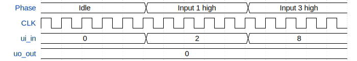

# TinyTapeout test

**Source:** [https://github.com/tulrich2/TinyTapeout](https://github.com/tulrich2/TinyTapeout)

**TinyTapeout Project Page:** [https://app.tinytapeout.com/projects/3505](https://app.tinytapeout.com/projects/3505)

## Input/Output Definitions

| Signal | Type | Width |
|--------|------|-------|
| ui_in | input | 8 |
| uo_out | output | 8 |

## First 10 Cycles

| Cycle | Phase | ui_in | uo_out |
|-------|-------|-------|-------|
| 0 | Idle | 0x0 (First input=0, Second input=0) | 0x0 (First output=0) |
| 1 | Idle | 0x0 (First input=0, Second input=0) | 0x0 (First output=0) |
| 2 | Idle | 0x0 (First input=0, Second input=0) | 0x0 (First output=0) |
| 3 | Idle | 0x0 (First input=0, Second input=0) | 0x0 (First output=0) |
| 4 | Idle | 0x0 (First input=0, Second input=0) | 0x0 (First output=0) |
| 5 | Input 1 high | 0x2 (First input=1, Second input=0) | 0x0 (First output=0) |
| 6 | Input 1 high | 0x2 (First input=1, Second input=0) | 0x0 (First output=0) |
| 7 | Input 1 high | 0x2 (First input=1, Second input=0) | 0x0 (First output=0) |
| 8 | Input 1 high | 0x2 (First input=1, Second input=0) | 0x0 (First output=0) |
| 9 | Input 1 high | 0x2 (First input=1, Second input=0) | 0x0 (First output=0) |

## Bit Patterns

### Input (ui_in)
- **ui_in**: Input signal mappings

### Output (uo_out)
- **uo_out**: Output signal mappings

## Test Waveform

